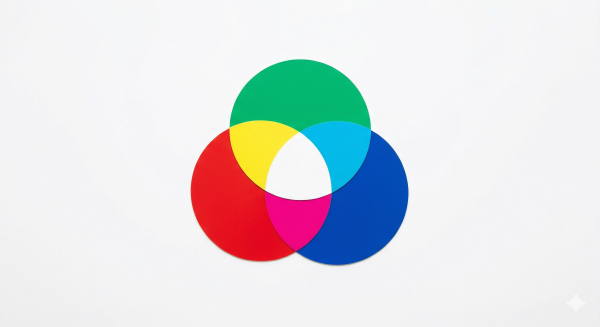

# Level 3 - random関数とRGB

- circleの直径を `random(0, 50)` にしてみよう

    ```p5.js hl_lines="7"
    function setup() {
      createCanvas(400, 400);
    }

    function draw() {
      // background(220);
      circle(mouseX, mouseY, random(0, 50))
    }
    ```

  - `random(0, 50)` は0から50までのランダムな数字を作る

## 円の色を変えてみる

- circle() の上に `fill(255, 0, 0)` と書いてみよう

    ```p5.js hl_lines="7"
    function setup() {
      createCanvas(400, 400);
    }

    function draw() {
      // background(220);
      fill(255, 0, 0)
      circle(mouseX, mouseY, random(0, 50))
    }
    ```

  - 色が変わった！
  - `fill()` はその名の通り、図形を指定した色でfillする (充填する) 命令
  - RGBについて
    - `fill()` の括弧の中は、基本的にRGBというルールで色を指定する
    - RGBとは光の三原色Red, Green, Blueのこと

        

    - それぞれの値は0~255
      - 白は(255, 255, 255)、黒は(0, 0, 0)
    - それぞれの値を組み合わせることで、約1680万色をディスプレイ上で表現できる

  - 好きに色をいじってみよう
    - p5.js、特にweb editorでは値をいじってみるのが良い  
        致命的な破壊は(ほとんど)起こらない
  - なお、`background()` も同じ

## ここで休憩

- ヒマだったらパラメーターをいじってみよう
