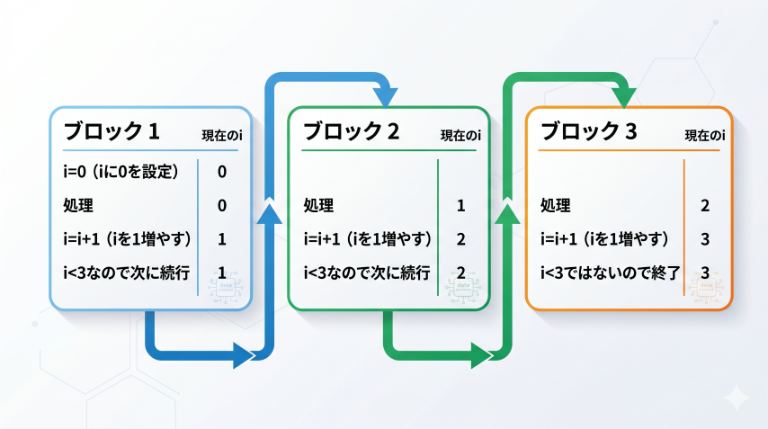

# Level 7 - for文

- for文とは
    - このような書き方のこと

        ```
        for (初期化式; 条件式; 変化式) {
            繰り返しやりたい処理
        }
        ```

    - 指定した回数や、条件を満たしている間、処理を繰り返すことができる
    - 「一定の規則で繰り返されるもの」はfor文で実装するのが良い
    - 初期化式と条件式と変化式
        - 初期化式は、ループを開始するときに1回だけ実行される
        - 条件式は、処理を繰り返すかどうかを判定する
        - 変化式は、処理が1回終わるたびに実行され、変数の値を更新する

    - 例

        ```
        for (let i = 0; i < 3; i = i + 1) {
            circle(x[i], y, random(0, 50));
        }
        ```

        

    - 難しいので、書くことで慣れよう

- for文を使って円を3つ出すプログラム

    ```p5.js hl_lines="15-17"
    let x = [100, 200, 300];
    let y = 0;

    function setup() {
        createCanvas(400, 400);
    }

    function draw() {
        y = y + 3;
        if (y > 400) {
            y = 0;
        }
        background(220);
        fill(255, 0, 0);
        for (let i = 0; i < 3; i++) {
            circle(x[i], y, 50);
        }
    }
    ```

- Level 6の「配列」では `circle()` は3行書いていたが、1行で済んだ！
    - こうすると変更がしやすいプログラムになる
