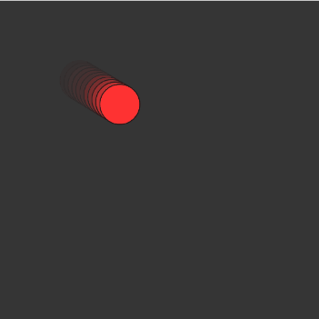

# おわりに

- どうでしたか？
    - 楽しめた？
    - 簡単だった / 難しかった
- p5.jsは、書いたプログラムが反映される様子がわかりやすく、プログラミング入門にぴったり
- Web Editorでアカウントを作成するとプログラムが保存できる
- OpenProcessing などのサイトで作品の例が見られる **オススメ！**  
   [Discover - OpenProcessing](https://openprocessing.org/discover/#/generativeart)
    - 作品のページを開き、上の `</>` ボタンを押すと、作品がどのようなプログラムで作られているか見られる
- ゲームも作れる
    - 例  
        - [p5.js Web Editor | shooter](https://editor.p5js.org/_SIDDHU_/sketches/epGClQAh0)
        - [p5.js Web Editor | mario](https://editor.p5js.org/k1628881@students.katyisd.org/sketches/aaTR4kTMJ)
        - [Slope Game - OpenProcessing](https://openprocessing.org/@u435101/2211483)
        - [(ALPHA) Arras.io BOSS RUSH! - OpenProcessing](https://openprocessing.org/@u291853/1983803)
        - [different kind of platformer - OpenProcessing](https://openprocessing.org/@u117796/554613)
        - [Far East (shooter game) - OpenProcessing](https://openprocessing.org/@u67512/769137)
    - ただしp5.jsはゲームを作るのに向いているわけではない

- p5.jsの公式サイトの "Reference" に使えるプログラムがすべて載っている  
    [Reference](https://p5js.org/reference/)  
    - 「そんなことできるんだ！」という驚きがあるかも

- **ワークショップが終わった後も、自分でp5.jsを遊んでもらえたらとても嬉しい**

    - この資料もそこそこ丁寧に作ったので、参考にしてもらえれば

- たとえばこれを作ってみよう

    

- 作りたいものを思いついたときに、それがどういう特徴か・どういうルールか、と考え、それをプログラムに落とし込んでいく
